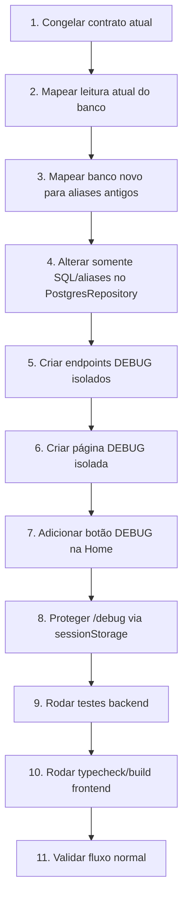
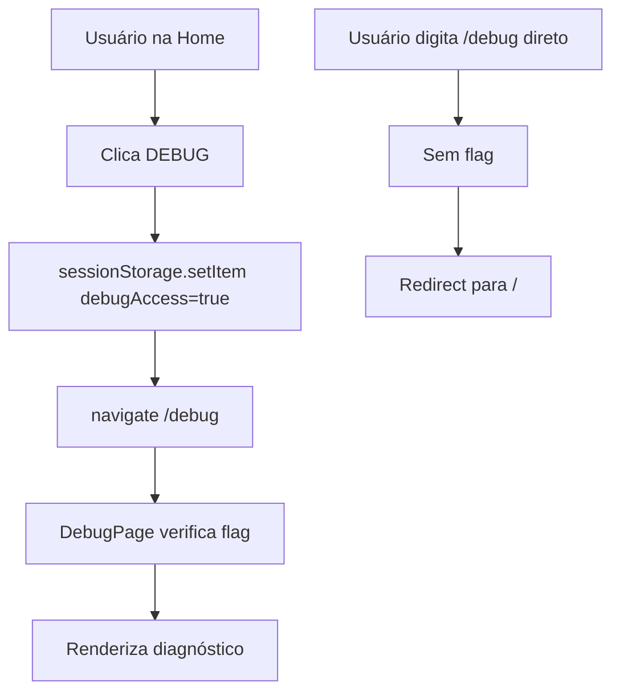

# Diagrama de tarefas — Energython DEBUG

## Ordem macro



## Diagrama de camadas

```mermaid
flowchart LR
    subgraph DB[Banco/DW]
      DW1[dw.mart_eolica]
      DW2[dw.dim_usina]
      DW3[dw.fato_restricao_coff]
      DW4[PLD]
    end

    subgraph Repo[Repository]
      R1[PostgresRepository]
      R2[SQL com aliases do contrato atual]
    end

    subgraph Normal[Fluxo normal]
      S1[FinanceiroService]
      S2[RegulatorioService]
      S3[CurtailmentService]
    end

    subgraph Debug[Fluxo DEBUG isolado]
      DS[DebugService]
      DR[DebugRouter /api/debug]
    end

    subgraph Front[Frontend]
      H[Home]
      B[Botão DEBUG]
      P[/debug]
      U[Fluxo normal /usinas]
    end

    DB --> Repo
    R1 --> R2
    Repo --> Normal
    Repo --> Debug
    Normal --> U
    Debug --> P
    H --> B
    B --> P
    H --> U
```

## Proteção da rota DEBUG



## Ordem de implementação segura

1. Criar/copiar backend DEBUG, sem registrar router.
2. Rodar `python -m py_compile` nos novos arquivos.
3. Registrar router em `main.py`.
4. Testar `/api/debug/health-dados`.
5. Criar frontend DEBUG.
6. Adicionar rota `/debug`.
7. Adicionar botão DEBUG na Home.
8. Rodar `npm run typecheck` e `npm run build`.
9. Testar que `/usinas`, `/usinas/:id`, financeiro e dossiê continuam funcionando.
